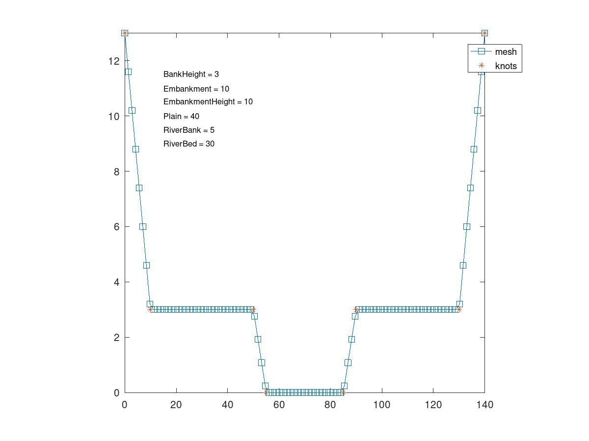
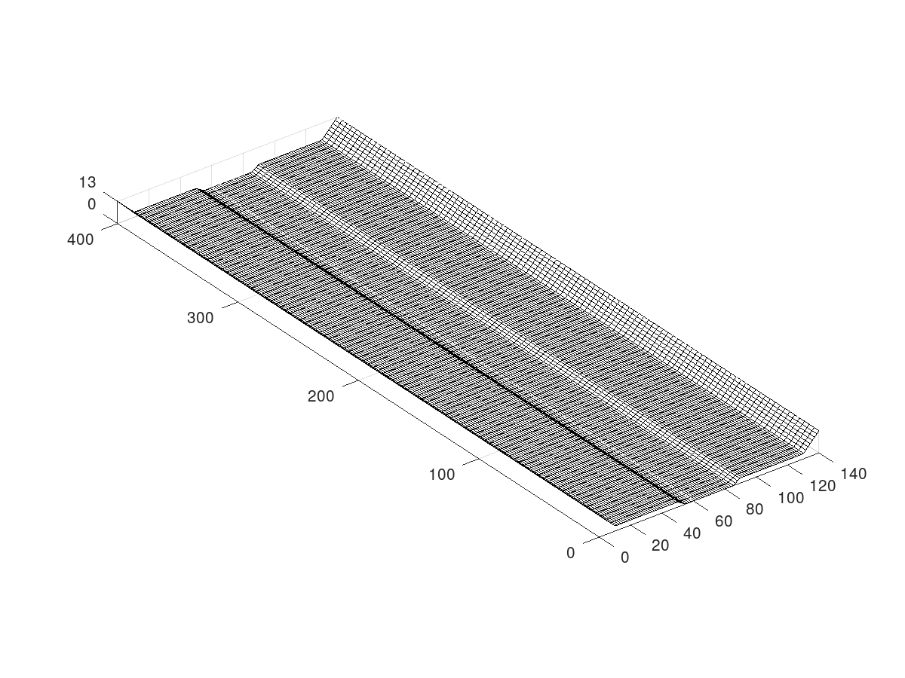
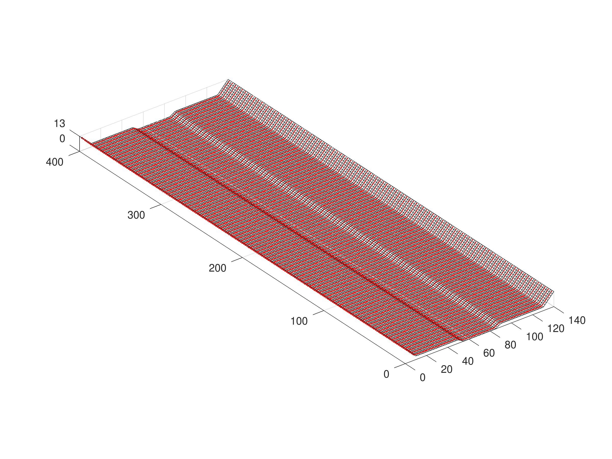

# fswof2d

GNU Octave package including utility functions to interact with the [FullSWOF_2D](https://www.idpoisson.fr/fullswof/) overland flow simulator.

The *fswof2d* package include a series of function that facilitate interaction
with the FullSWOF_2D simulator. Minimal requirements in order to run a
FullSWOF_2D simulation are:
* topography file: *topography.dat*
* initial conditions file: *huv_init.dat*
* simulation parameters file: *parameters.txt*

Writing these files in a format fully-compatible with FullSWOF_2D (:heavy_exclamation_mark:v-1.07.00:heavy_exclamation_mark:) can be easily
achieved by using the functions `topo2file`, `huv2file` and `params2file`.

The function `read_params` allows reading the parameters used for a given
simulation (stored in the `parameters.txt` file) as a `struct`. This can be
useful in order to carry out sensitivity analysis where one or more simulation
parameters are to be varied.

*GNU Octave* and *FullSWOF_2D* have different ways of representing 3D meshes.
The function `dataconvert` makes passing from the `fswof2d` 3D mesh
representation to the `octave` one and vice-versa an easy task. Mesh nodes
coordinates have to be written to the *topography.dat* file in the `fswof2d`
format. However, one would probably want to plot the mesh in *GNU Octave*, in
order to check for correctness, before writing it to the file. `dataconvert`
ensures proper conversion of the plotted `octave` mesh to the `fswof2d` format.

Computations in *FullSWOF_2D* are performed at every cell center. For this
reason, the *topography.dat* file must specify the X-Y coordinates of the cells
centers and not of their nodes. If a coordinate in the topography file is
located on the domain boundary (meaning it cannot represent the center of a
cell), *FullSWOF_2D* throws an error. `node2center` converts therefore a vector
of nodes coordinates to the corresponding vector of centers coordinates.
`center2node` executes the inverse operation, returning a vector of nodes given
a vector of centers.

The function `csec_channel2lvlsym` simplifies the construction of a standard
symmetric channel cross-section, composed of a riverbed, two riverbanks, two
floodplains and two external embankments. The cross-section is discretized
in `N` segments according to the user's needs. Once the cross-section is
created, it has to be extruded along an axis, in order to result in a channel
topography. This can be accomplished with the function `extrude_csec`.

Finally, the function `matplotlib_cm` allows import in *GNU Octave* of colormaps
defined in the *Python-package* `matplotlib`.

## Code example
```matlab
pkg load fswof2d

% Generate cross-section and plot it
Nx = 100 % number of x-nodes
[x z p xi zi] = csec_channel2lvlsym (Nx);
elements = fieldnames (p);
plot(x,z,'s-;mesh;',xi,zi,'*;knots;')
hold on
axis tight

for i = 1:length (elements)
  t = sprintf ("%s = %d", elements{i}, p.(elements{i}));
  text (15, 12-0.5*i, t, 'fontsize', 8);
end
axis square
hold off
print (fullfile (imgs_dir, 'csec.png'))

% Extrude cross-section and plot it
L = 400 % channel length
Ny = 100 % number of y-nodes

y = linspace (0, L, Ny);

[X Y Z] = extrude_csec (x, y, z);
mesh (X, Y, Z, 'edgecolor', 'k');
axis equal
axis tight
set (gca, 'ztick', [min(z), max(z)]);
print (fullfile (imgs_dir, 'mesh.png'))
```


```matlab
% Find the centers of the mesh
xc = node2center (x);
yc = node2center (y);
zc = node2center (z);

[XC YC ZC] = extrude_csec (xc, yc, zc);

mesh (X, Y, Z, 'edgecolor', 'k');
hold on
p = scatter3 (XC, YC, ZC, 3, 'r', 'filled');
hold off
axis equal
axis tight
set (gca, 'ztick', [min(z), max(z)]);
print (fullfile (imgs_dir, 'mesh-red.png'), '-r300')
```



## Complete Functions list
* `topo2file`
* `huv2file`
* `params2file`
* `read_params`
* `dataconvert`
* `center2node`
* `node2center`
* `csec_channel2lvlsym`
* `extrude_csec`
* `matplotlib_cm`


## Install
